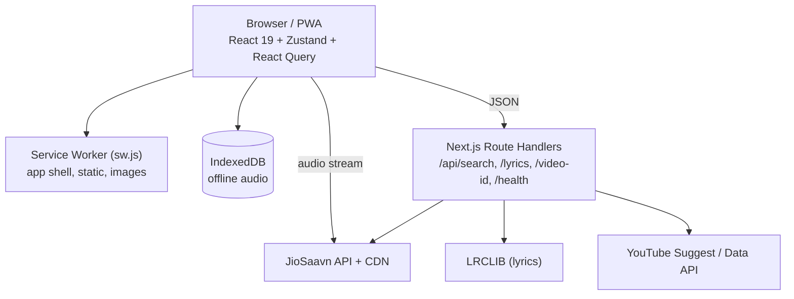

# Free Music — YouTube Music Web & PWA Clone

[](LICENSE)
[](https://nextjs.org/)
[](https://react.dev/)
[](https://tailwindcss.com/)
[](https://web.dev/progressive-web-apps/)

A high-performance, ad-free music streaming Progressive Web Application (PWA) built with **Next.js 15 (App Router)**, **React 19**, **Tailwind CSS v4**, and **Zustand**. Designed with the authentic YouTube Music interface, real-time audio frequency visualizer, instant song radio, time-synchronized karaoke lyrics, intelligent typo-tolerant search, and offline IndexedDB downloads.

---

## Key Features

- **High-Fidelity Audio Streaming**: Direct JioSaavn CDN streaming up to 320 kbps with DES URL decryption.
- **Web Audio Analyser & Visualizer**: Real-time 64-band audio frequency visualizer canvas rendering responsive waveforms.
- **Instant Song Radio**: One-click radio launcher generating endless continuous recommended queues from any track.
- **Synchronized Karaoke Lyrics**: Real-time synced lyrics with autoscroll, click-to-seek, and interactive `[-0.5s]` / `[+0.5s]` timing offset controls.
- **Intelligent Search Engine**: Multi-stage phonetic typo correction (`"move"` $\rightarrow$ `"movie"`), entity extraction, category filtering (Songs, Albums, Artists, Playlists), and YouTube suggest fallback.
- **Offline Storage & Downloads**: IndexedDB audio blob storage (`free_music_db`) for 100% offline playback with zero bandwidth consumption.
- **Continuous Auto-Play & Background Prefetching**: Seamless gapless queue extension starting 12 seconds prior to track completion.
- **Interactive Drag-and-Drop Queue**: Reorder upcoming songs smoothly via `@dnd-kit`, shuffle, and repeat modes.
- **Full PWA Support**: Installable on Android, iOS, Windows, and macOS with service worker caching and HTTP 206 range-request scrubbing.
- **Dynamic Mood Filters**: Explore songs categorized by vibe (*Energize, Relax, Focus, Party, Romance, Workout*).
- **Responsive Theming**: Authentic dark/light system theming implemented with semantic CSS variables.

For an exhaustive feature breakdown, visit [`docs/features/features.md`](docs/features/features.md).

---

## Architecture at a Glance



Audio is played only by the global `AudioManager`; UI components drive it through the Zustand `player` and `queue` stores. See [`docs/architecture/architecture.md`](docs/architecture/architecture.md) for the full design, data flows and caching layers.

### Repository Layout

```
apps/web/        Next.js app (app/ routes + API, components/, lib/ logic, stores/, e2e/, public/, vercel.json)
docs/            Architecture, features, research, specs and plans
.github/         CI workflow, issue and PR templates
```

---

## Documentation & AI System Guides

This repository is built and maintained with AI agent workflows. We provide comprehensive documentation for both human engineers and AI assistants:

| Document | Description |
|---|---|
| **[`docs/features/features.md`](docs/features/features.md)** | Exhaustive breakdown of all app features, keyboard shortcuts, and UI interactions. |
| **[`docs/architecture/architecture.md`](docs/architecture/architecture.md)** | System architecture, Web Audio pipeline, data flow diagrams, and Zustand state models. |
| **[`GEMINI.md`](GEMINI.md)** | Architectural invariants and verification commands for Gemini / Antigravity agents. |
| **[`AGENTS.md`](AGENTS.md)** | Universal developer and AI agent guide detailing codebase conventions and pitfalls. |
| **[`CLAUDE.md`](CLAUDE.md)** | Execution instructions and constraints for Claude Code assistants. |
| **[`.cursorrules`](.cursorrules)** | Rule configuration for Cursor and Windsurf AI editors. |
| **[`.github/copilot-instructions.md`](.github/copilot-instructions.md)** | Dedicated context and invariant instructions for GitHub Copilot. |
| **[`docs/`](docs/README.md)** | Technical design specifications (`specs/`) and implementation plans (`plans/`). |
| **[`CONTRIBUTING.md`](CONTRIBUTING.md)** | Contribution standards, development setup, and pull request checklist. |
| **[`SECURITY.md`](SECURITY.md)** | Security reporting policy and vulnerability disclosure procedures. |
| **[`LICENSE`](LICENSE)** | Open-source MIT License. |

---

## Quick Start

### Prerequisites
- Node.js 20+ or 24+
- `pnpm` 9+

### Installation & Development
```bash
# 1. Install dependencies
pnpm install

# 2. Start local development server
pnpm dev
```
Open [http://localhost:3000](http://localhost:3000) to start listening.

### Environment Variables
Copy `apps/web/.env.example` to `apps/web/.env.local` if you want to set the optional `YOUTUBE_API_KEY`. Without it, video resolution falls back to a zero-config mode, so the app runs with no configuration.

---

## Verification & Quality Assurance

All pull requests and code modifications must pass automated verification:

```bash
# Run unit test suite (Node.js native test runner)
pnpm --filter web test

# Run ESLint validation
pnpm --filter web lint

# Build production bundle (Next.js App Router + PWA Service Worker)
pnpm --filter web build

# Browser end-to-end tests (Playwright; starts its own dev server on :3005)
pnpm --filter web exec playwright install chromium   # first run only
pnpm test:e2e
```

CI (`.github/workflows/ci.yml`) runs unit tests, lint and the production build on every push and pull request to `main`, and runs the Playwright suite in a separate job.

---

## Deployment (Vercel)

1. Import the repository in Vercel.
2. In **Project Settings → General**, set **Root Directory** to `apps/web` (Vercel then uses `apps/web/vercel.json` and installs from the pnpm workspace root automatically).
3. Optionally add `YOUTUBE_API_KEY` under Environment Variables.
4. After the first deploy, check `/`, `/search?q=test` and `/api/health`.

---

## License

This project is open-source and available under the [MIT License](LICENSE).
