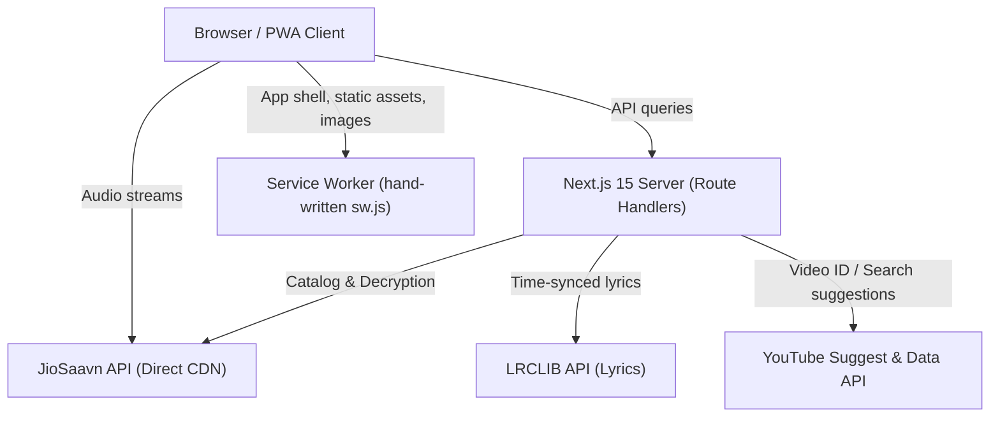
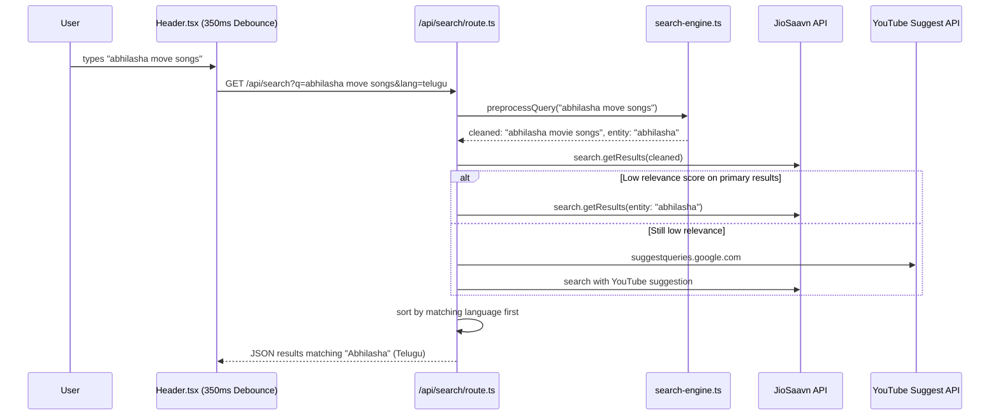
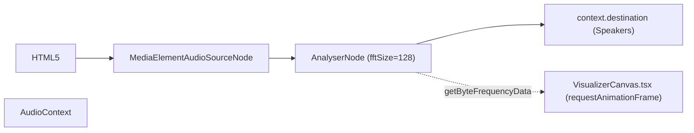
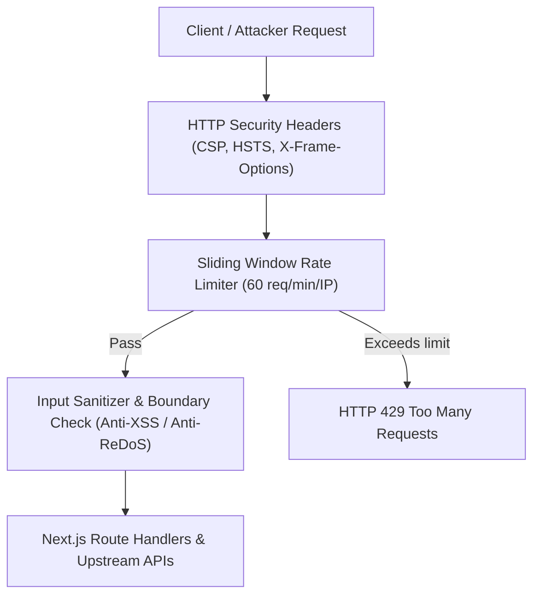
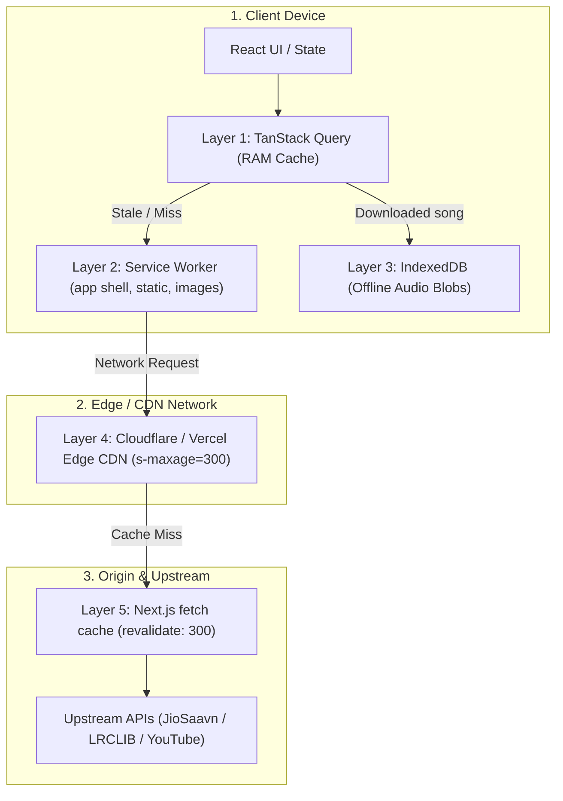
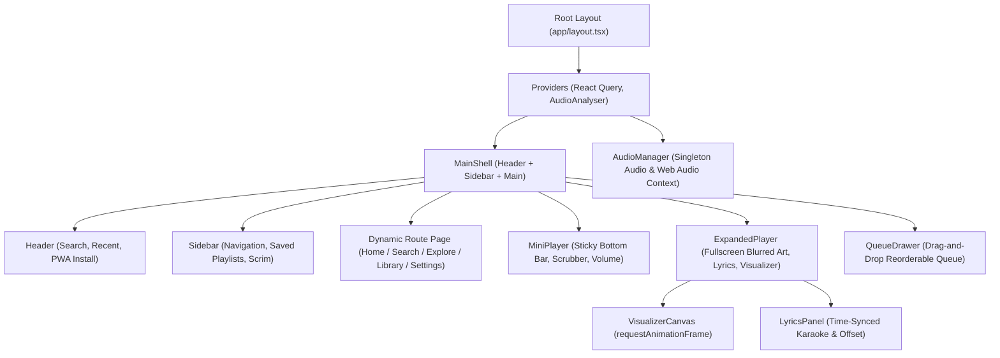
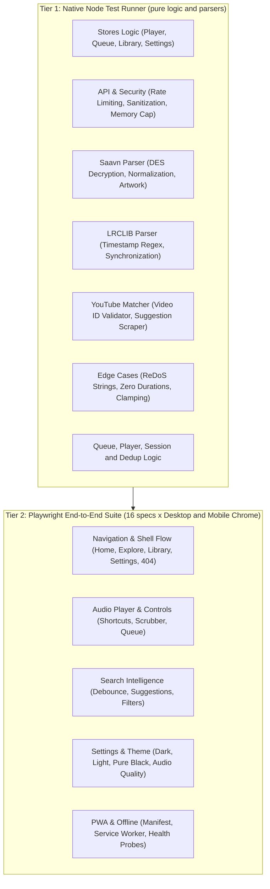

# YouTube Music Clone — Architecture Guide

This guide provides a comprehensive technical overview of the system architecture, technology stack, component hierarchy, data flow pipelines, and state management models.

---

## 1. System Overview & Technology Stack

The project is a **pnpm workspace monorepo** (`pnpm-workspace.yaml` -> `apps/*`) with a single Next.js App Router application, `apps/web`. Root scripts (`pnpm dev`, `pnpm test`, `pnpm build`) delegate to it.



### Core Technologies
- **Framework**: [Next.js 15.3.4 (App Router)](https://nextjs.org/) with React 19.
- **Styling**: [Tailwind CSS v4](https://tailwindcss.com/) with pure CSS variable tokens for theming.
- **State Management**: [Zustand v5](https://zustand-demo.pmnd.rs/) with localStorage persistence.
- **Data Fetching & Cache**: [TanStack React Query v5](https://tanstack.com/query/latest) with request deduplication and abort signals.
- **Drag and Drop**: [@dnd-kit/core](https://dndkit.com/) and `@dnd-kit/sortable` for queue reordering.
- **Cryptography**: [CryptoJS](https://cryptojs.gitbook.io/) for DES decryption of JioSaavn media URLs.
- **PWA & Offline**: a hand-written service worker (`public/sw.js`, no build step) for the app shell and static assets, plus IndexedDB for offline audio downloads.
- **Audio Processing**: HTML5 Audio + Web Audio API (`AudioContext`, `AnalyserNode`) for 64-band real-time visualizer canvas rendering.

---

## 2. Directory Structure

```
free-music/
├── apps/
│   └── web/
│       ├── app/                         # Next.js 15 App Router Routes
│       │   ├── layout.tsx               # Root layout, HTML theme, Viewport
│       │   ├── page.tsx                 # Home page (discovery carousels, moods)
│       │   ├── globals.css              # Theme CSS variables & custom scrollbars
│       │   ├── album/[id]/page.tsx      # Dynamic album details & track list
│       │   ├── artist/[id]/page.tsx     # Dynamic artist profile & discography
│       │   ├── playlist/[id]/page.tsx   # Custom & public playlist viewer
│       │   ├── search/page.tsx          # Multi-tab search page with pagination
│       │   ├── explore/page.tsx         # Mood & genre discovery grids
│       │   ├── library/page.tsx         # User saved library, playlists, downloads
│       │   ├── settings/page.tsx        # Quality, language, theme controls
│       │   ├── watch/page.tsx           # Full-screen watch view
│       │   └── api/                     # Server Route Handlers
│       │       ├── search/route.ts      # Unified search, sections, details, recommendations, typeahead (?suggest=1)
│       │       ├── lyrics/route.ts      # Time-synced lyrics endpoint
│       │       ├── video-id/route.ts    # YouTube music video ID resolver
│       │       └── health/route.ts      # Uptime probe (no-store)
│       ├── components/                  # React UI Components
│       │   ├── AudioManager.tsx         # Global HTML5 audio & Web Audio controller
│       │   ├── layout/                  # Header, Sidebar, MainShell
│       │   ├── player/                  # MiniPlayer, ExpandedPlayer, VisualizerCanvas, LyricsPanel, QueueDrawer
│       │   ├── home/                    # Carousels, MoodChips, ForYouSection, QuickPicksSection
│       │   ├── search/                  # AlbumCard, ArtistCard, PlaylistCard
│       │   └── ui/                      # ContextMenu, Toast notifications
│       ├── lib/                         # Core Utilities & Backend Logic
│       │   ├── saavn.ts                 # JioSaavn API client, DES decryptor, search/section/detail fetchers
│       │   ├── search-engine.ts         # Query preprocessing, typo engine, relevance scoring
│       │   ├── song-dedup.ts            # Dedupes songs by title + artists (JioSaavn reuses one song under many ids)
│       │   ├── recommendations.ts       # Radio / autoplay recommendation merging
│       │   ├── lrclib.ts, lyrics-sync.ts # LRCLIB client and synced-lyrics line logic
│       │   ├── youtube.ts               # YouTube video matcher & suggest client
│       │   ├── offline-storage.ts       # IndexedDB audio blob storage & byte stats
│       │   ├── queue-logic.ts, player-logic.ts, session.ts # Pure playback/queue/session logic behind the stores
│       │   ├── home-feed.ts, detail-queries.ts, api-urls.ts # Home feed assembly and shared query/URL builders
│       │   ├── settings-persist.ts, dedup-storage.ts, languages.ts, recent-searches.ts # Persistence and settings helpers
│       │   ├── security.ts, rate-limiter.ts, logger.ts # Input sanitizers, per-IP limiter, logging
│       │   ├── utils.ts                 # Time formatters, quality URL transform, image sizing
│       │   └── *.test.mjs               # Node test runner unit tests
│       ├── stores/                      # Zustand Global Stores
│       │   ├── player.store.ts          # Playback state, track, volume, loop
│       │   ├── queue.store.ts           # Song queue, history, shuffle, DND, appendSongs
│       │   ├── library.store.ts         # Liked songs, custom user playlists
│       │   ├── settings.store.ts        # Language, audio quality, autoplay, theme, lyricsOffset
│       │   └── ui.store.ts              # Sidebar & modal open states
│       ├── e2e/                         # Playwright end-to-end specs
│       ├── public/                      # PWA assets: icons, manifest.json, offline.html, sw.js
│       ├── vercel.json                  # Vercel config (project Root Directory = apps/web)
│       ├── next.config.ts               # Security headers / CSP, sw.js cache headers, self polyfill
│       ├── .env.example                 # Optional YOUTUBE_API_KEY
│       └── package.json                 # Web workspace dependencies and test script
├── docs/                                # Architecture, features, research, plans and specs
│   ├── architecture/architecture.md     # System architecture (this document)
│   ├── features/features.md             # Comprehensive feature catalog
│   └── superpowers/{plans,specs}/       # Implementation plans and feature specs
├── .github/                             # CI workflow, issue and PR templates
├── AGENTS.md                            # Universal AI developer onboarding guide
├── GEMINI.md                            # Gemini / Antigravity AI guide
├── CLAUDE.md                            # Claude Code AI guide
├── CONTRIBUTING.md                      # Human & AI contributor guidelines
├── SECURITY.md                          # Security reporting policy
├── LICENSE                              # MIT License
├── pnpm-workspace.yaml                  # Workspace definition (apps/*)
└── package.json                         # Root scripts (dev, build, test, lint, test:e2e)
```

---

## 3. Data Flow Pipelines

### 3.1 Audio Streaming Flow

```mermaid
sequenceDiagram
    participant UI as Component (SongCard / Table)
    participant PS as player.store / queue.store
    participant AM as AudioManager.tsx
    participant Audio as HTML5 <audio>
    participant Saavn as JioSaavn CDN

    UI->>PS: playSong(song, queue, index)
    PS->>AM: reactive update (currentSong, isPlaying)
    AM->>AM: getAudioQualityUrl(song.downloadUrl, quality)
    AM->>Audio: audio.src = streamUrl; audio.play()
    Audio->>Saavn: HTTP GET / Range request (206 Partial Content)
    Audio-->>AM: ontimeupdate / onended
    AM->>PS: update currentTime, duration, isPlaying
```

### 3.2 Search Intelligence & Typo Correction Flow



---

## 4. State Management Architecture (Zustand Stores)

The application uses **Zustand** stores scoped to specific functional domains:

| Store | File | Key state | Persistence |
|---|---|---|---|
| `player.store` | `stores/player.store.ts` | `currentSong`, `isPlaying`, `isLoading`, `progress`, `duration`, `volume`, `muted`, `mode` (audio/video), `isExpanded` | `localStorage`: `currentSong`, `volume`, `muted`, `mode` |
| `queue.store` | `stores/queue.store.ts` | `queue`, `shuffledQueue`, `qIndex`, `shuffleOn`, `repeatMode`; actions `jumpTo`, `moveItem`, `removeAt`, `appendSongs` | `localStorage` |
| `library.store` | `stores/library.store.ts` | `likedSongs`, `history`, `playlists` and their actions | `localStorage` |
| `settings.store` | `stores/settings.store.ts` | `language`, `theme`, `fontSize`, `audioQuality` (low/normal/high), `autoplay`, `crossfade`, `gapless`, sleep timer, EQ, lyrics size/offset | `localStorage` (via `settings-persist.ts`) |
| `ui.store` | `stores/ui.store.ts` | `sidebarCollapsed`, `queueOpen` | `localStorage` |

All persisted stores write through a de-duplicating storage wrapper (`lib/dedup-storage.ts`) that skips redundant writes. Queue invariants (`qIndex` always indexes the active list) live in the pure `lib/queue-logic.ts`.

---|---|---|---|
| `player.store` | `stores/player.store.ts` | `currentSong`, `isPlaying`, `currentTime`, `duration`, `volume`, `isMuted`, `isExpanded`, `loopMode` | Memory (session) |
| `queue.store` | `stores/queue.store.ts` | `queue`, `currentIndex`, `history`, `isShuffled`, `originalQueue`, reorder actions, `appendSongs` | `localStorage` |
| `library.store` | `stores/library.store.ts` | `favorites`, `playlists`, `addSongToPlaylist`, `removePlaylist`, `toggleFavorite` | `localStorage` |
| `settings.store` | `stores/settings.store.ts` | `language`, `audioQuality` (48k/160k/320k), `theme`, `autoplay`, `lyricsOffset` | `localStorage` |
| `ui.store` | `stores/ui.store.ts` | `sidebarOpen`, `queueDrawerOpen`, `activeModal` | Memory (session) |

---

## 5. PWA & Offline Caching Architecture

The service worker is a hand-written file, [`public/sw.js`](../../apps/web/public/sw.js), registered from `components/providers.tsx`. It has no build step; `next.config.ts` serves it with `Cache-Control: no-cache` so updates ship immediately. Bump `CACHE_VERSION` in `sw.js` whenever the caching rules or `SHELL_URLS` change; old caches are deleted on `activate`.

| Request | Strategy | Cache |
|---|---|---|
| Navigations | Network first, falls back to the cached page, then `/offline.html` (max 50 pages) | `fm-shell-*` |
| `/_next/static/*` | Cache first | `fm-static-*` |
| Google Fonts | Stale-while-revalidate | `fm-static-*` |
| Same-origin images | Stale-while-revalidate (max 200 entries) | `fm-images-*` |
| `/api/*`, range requests, audio files | Never intercepted; always network | none |

Audio is intentionally not cached by the service worker. Offline songs live in IndexedDB (section 6), which avoids range-request edge cases.

`next.config.ts` also keeps the top-level shim `if (typeof globalThis.self === 'undefined') globalThis.self = globalThis` to prevent `ReferenceError: self is not defined` crashes during `next dev` on newer Node versions.

---

## 6. Client-Side Offline Storage & Auto-Play Engine

### 6.1 IndexedDB Offline Architecture
- **Database**: `free_music_db` (version 1) managed in [`offline-storage.ts`](../../apps/web/lib/offline-storage.ts).
- **Store**: `downloaded_songs` with `id` keyPath.
- **Record Schema**:
  - `id`: Unique track PID string.
  - `title`, `artist`, `album`, `duration`, `image`, `language`, `year`: Cached track metadata.
  - `blob`: Raw audio binary `Blob` downloaded at user-selected audio quality.
  - `fileSize`: Exact byte length of audio stream.
  - `downloadedAt`: Timestamp for chronological sorting.
- **Zero-Latency Offline Playback**:
  - [`AudioManager.tsx`](../../apps/web/components/AudioManager.tsx) checks IndexedDB whenever track changes.
  - If a song is downloaded, `URL.createObjectURL(record.blob)` creates a local blob URL for playback without internet access.
  - Preloaded next tracks also resolve offline blobs ahead of time for gapless offline listening.

### 6.2 Continuous Auto-Play & Radio Prefetching
- **End-of-Queue Continuation**: When the active queue reaches its end and `repeatMode === 'none'` with `autoplay: true`:
  - Recommendations are fetched for the current seed song (`/api/search?recommendSongId=...`).
  - New songs are filtered against existing track IDs and appended via `useQueueStore.getState().appendSongs()`.
- **Zero-Gap Background Prefetching**:
  - During `ontimeupdate`, if `qIndex >= activeQueue.length - 1` and `currentTime >= duration - 12s`, recommendations are prefetched in the background.
  - The queue expands seamlessly before playback ends, ensuring no stutter or waiting animation when moving to the next track.

---

## 7. Web Audio Analyser & Real-Time Canvas Visualizer



1. **Audio Node Topology**:
   - The `<audio>` element is configured with `crossOrigin="anonymous"` allowing Web Audio access to CORS-enabled streams from `aac.saavncdn.com`.
   - `AudioContext.createMediaElementSource(audioRef.current)` routes audio into an `AnalyserNode` before sending it to `ctx.destination`.
   - The graph connection is idempotent and protected against multiple `createMediaElementSource` calls on the same element.
2. **Frequency Rendering**:
   - `AnalyserNode` uses `fftSize = 128` (giving 64 frequency bins, rendering 32 symmetric dual-channel bars).
   - Dynamic canvas sizing adjusts to container width while respecting device pixel ratio.
   - Smooth animated falloff bars use CSS variable gradients (`var(--accent)` to `var(--text-secondary)`).

---

## 8. Song Radio Architecture

- **Context Menu & Now Playing Triggers**: Any song across the application can seed an instant endless radio station.
- **Flow**:
  1. Immediately plays the selected song as index 0.
  2. Queries `/api/search?recommendSongId=<seedSongId>` to pull related artist releases and genre trends.
  3. Replaces the current queue with `[seedSong, ...recommendations]`.
  4. Triggers an instant toast notification: *"Radio started from '<Song Name>'"*.
  5. Continuous autoplay remains active, appending new recommendations as the queue progresses.

---

## 9. Time-Synced Lyrics Synchronization & Nudge

- **LRCLIB Client Integration**: Queries `/api/lyrics?title=...&artist=...&duration=...` for timestamped lyrics formatted as `[mm:ss.xx] line`.
- **Interactive Offset Sync**:
  - Stored in `settings.store.ts` (`lyricsOffset: number` in seconds).
  - Adjusted via toolbar buttons in [`LyricsPanel.tsx`](../../apps/web/components/player/LyricsPanel.tsx):
    - `[-0.5s]`: Nudge lyrics forward if they lag behind the vocal track.
    - `[Reset]`: Reset offset to 0.0s.
  - Active line detection calculates `currentTime + lyricsOffset` to highlight the current line with autoscroll.

---

## 10. Security Architecture & Threat Mitigations



1. **HTTP Security Headers & CSP**:
   - `Content-Security-Policy`: Restricts scripts, frames, media, fonts, and network targets to authenticated origins. Blocks unauthorized `<iframe>` embedding (`frame-ancestors 'self'`) and legacy objects (`object-src 'none'`).
   - `X-Frame-Options: SAMEORIGIN`: Prevents Clickjacking and UI redressing attacks.
   - `X-Content-Type-Options: nosniff`: Prevents MIME-sniffing drive-by execution attacks.
   - `Referrer-Policy: strict-origin-when-cross-origin`: Stops search keyword and route leakage across network boundaries.
   - `Strict-Transport-Security`: Enforces HSTS (2-year preload policy).
   - `Permissions-Policy`: Restricts device sensor and hardware access (camera, microphone, payment, geolocation).
2. **API Abuse & DoS Protection**:
   - In-memory sliding window rate limiter in [`apps/web/lib/rate-limiter.ts`](../../apps/web/lib/rate-limiter.ts) tracking client IP.
   - Throttles requests per IP with automatic 429 response, `Retry-After` headers, and LRU/FIFO memory capping at 50,000 entries (<5MB heap footprint under DDoS).
3. **Input Sanitization & Injection Defense**:
   - Implemented in [`apps/web/lib/security.ts`](../../apps/web/lib/security.ts).
   - Strips null bytes (`\0`), control characters, and script tags (`<script>`, `javascript:`).
   - Strict alphanumeric format and length bounds on resource IDs (`^[a-zA-Z0-9_\-\.]+$`), rejecting directory traversal (`../`) and command injections.
   - Constrains query strings to 150 characters to prevent ReDoS and memory exhaustion.

---

## 11. Multi-Tier Caching Topology



---

## 12. Component Hierarchy & UI Architecture



---

## 13. Quality Assurance & Testing Architecture

The codebase enforces a two-tier automated testing pyramid ensuring rock-solid stability and zero regressions across all features:



### Verification Commands
```bash
# Run unit & logical tests
pnpm --filter web test

# Run Playwright E2E browser tests (starts its own dev server on :3005)
pnpm --filter web test:e2e

# Run ESLint validation (must be 0 errors, 0 warnings)
pnpm --filter web lint

# Build production bundle
pnpm --filter web build
```

