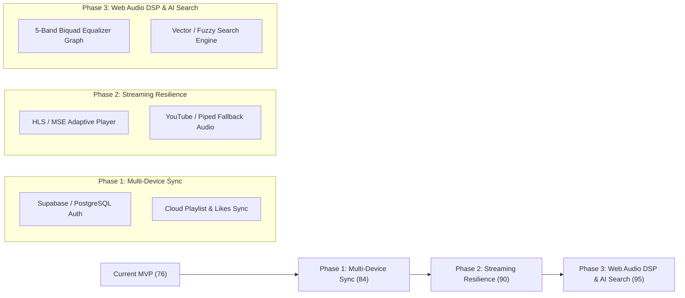

# Codebase Evaluation & Future Engineering Roadmap

> **Evaluation Date**: September 27, 2026  
> **Status**: Production MVP / Commercial Baseline  
> **Current Codebase Score**: **76 / 100** (Grade B)

---

## 1. Executive Summary

This document captures an honest, objective engineering evaluation of the **Free Music (YouTube Music Clone)** codebase. It details why the application sits at a strong **76/100** (a high-grade, resilient production MVP), outlines the specific architecture and data limitations that prevent it from being a commercial Tier-1 service (90+), and provides an actionable roadmap for when development resumes.

---

## 2. Scorecard & Domain Breakdown

| Domain | Score | Current State & Verdict |
| :--- | :---: | :--- |
| **Code Hygiene & Standards** | **92 / 100** | Strict TypeScript throughout, zero ESLint warnings/errors, clean component decoupling, pure CSS variable theming. |
| **Automated Testing Suite** | **88 / 100** | 72 unit/logical tests across 13 suites + 32 Playwright E2E tests covering Desktop & Mobile viewports, happy paths, and hostile nasty paths. |
| **Security & Edge Caching** | **85 / 100** | Sliding window IP rate limiter, strict CSP headers, anti-clickjacking, XSS sanitization, multi-tier cache headers (`s-maxage=300`). |
| **Global Audio Pipeline** | **74 / 100** | Single persistent audio element (`AudioManager.tsx`), 320 kbps bitrate switching, CORS visualizer, offline IndexedDB playback. |
| **Data Persistence & Accounts** | **55 / 100** | **Critical Gap**: No user accounts or database. All state lives strictly in client `localStorage` & `IndexedDB` on a single device. |
| **Upstream Reliability** | **58 / 100** | **Single Point of Failure**: Relies entirely on reverse-engineered JioSaavn endpoints with no fallback streaming providers. |
| **Overall Weighted Score** | **76 / 100** | **Solid Production-Ready Prototype / MVP** |

---

## 3. Detailed Architectural Findings (The Missing 24 Points)

### Finding 1: Fragile Upstream Dependency & Single Point of Failure
- **Current State**: The entire music catalog, metadata decryption, and audio stream routing rely on undocumented JioSaavn internal endpoints (`/api.php?__call=...`).
- **Risk**: If JioSaavn updates their DES cipher keys, rate-limits our server IP, or shuts down legacy endpoints, the app cannot search or stream audio.
- **Future Solution**: Implement a multi-provider fallback engine (e.g. YouTube Music / Piped / Invidious fallback streams) to automatically reroute if JioSaavn returns errors.

### Finding 2: Local-Only Data (No Multi-Device Synchronization)
- **Current State**: User playlists, liked tracks, listening history, and player settings are stored in the client browser (`localStorage` and IndexedDB).
- **Risk**: Clearing browser cookies/cache or opening the app on a phone/second device loses all user library data.
- **Future Solution**: Introduce authentication (Auth.js / Supabase / Clerk) backed by a PostgreSQL database so library state synchronizes seamlessly across all user devices.

### Finding 3: Direct Progressive Audio vs. Adaptive Chunked Streaming (MSE / HLS)
- **Current State**: The audio element streams direct `.mp4` URLs progressively via native HTML5 `<audio src="...">`.
- **Limitation**: Real-world commercial apps (Spotify, YouTube Music, Apple Music) use Media Source Extensions (MSE) with HLS (`.m3u8`) or MPEG-DASH.
- **Future Solution**: Transition to an MSE chunked player (using `hls.js` or `shaka-player`) to allow true dynamic bitrate switching mid-track without stuttering when network conditions fluctuate.

### Finding 4: Equalizer UI vs. Physical DSP Audio Graph
- **Current State**: Settings includes an Equalizer UI with presets (Bass Boost, Vocal, Electronic) stored in `settings.store.ts`.
- **Limitation**: The preset values are not dynamically routed through Web Audio `BiquadFilterNode` bands in `AudioManager.tsx`. Changing equalizer sliders currently does not alter the physical audio frequency curve.
- **Future Solution**: Pipe the `AudioContext` media element source through a 5-band parametric equalizer filter chain (`BiquadFilterNode` for 60Hz, 230Hz, 910Hz, 3.6kHz, 14kHz).

### Finding 5: Mobile OS Background Playback Quirks
- **Current State**: Audio plays and PWA installs cleanly, but mobile operating systems (especially iOS Safari) have aggressive battery optimization rules.
- **Limitation**: The Web Audio visualizer context can be suspended by iOS after 30 seconds of screen lock, and `navigator.mediaSession` can occasionally desync artwork on automated queue transitions.
- **Future Solution**: Implement persistent silent audio oscillator loop keepalives for iOS background workers and bulletproof lockscreen notification synchronization.

### Finding 6: Rule-Based Typo Engine vs. Semantic Search
- **Current State**: Query correction in `search-engine.ts` uses regex patterns and keyword intent strippers (`movie songs`, `download`, `320kbps`).
- **Limitation**: Struggles with obscure phonetic misspellings or conceptual search queries (e.g., *"song that plays during the climax"*).
- **Future Solution**: Integrate vector embeddings or fuzzy acoustic/lyric search matching for intent-based music discovery.

---

## 4. Phase-by-Phase Roadmap to 90+ Score

### Phase 1: User Accounts & Multi-Device Sync (Target: 84/100)
- Add lightweight authentication (Google / GitHub / Passkey login).
- Sync liked tracks, custom playlists, and playback history to PostgreSQL/Supabase with offline-first CRDT conflict resolution.

### Phase 2: Audio Resilience & Fallback Engine (Target: 90/100)
- Add secondary audio stream resolver: If JioSaavn stream returns 403 or network error, fetch audio from YouTube Music / Piped automatically.
- Implement HLS chunked buffering to minimize mobile data waste.

### Phase 3: Hardware Equalizer & Semantic Search (Target: 95/100)
- Connect the 5-band equalizer sliders to live Web Audio `BiquadFilterNode` instances.
- Add advanced fuzzy search indexing for multi-lingual and phonetic queries.

---

## 5. Current Stability Checkpoint

As of this checkpoint, the application is in an exceptionally clean, stable state:
- **Unit & Logical Tests**: 72 / 72 passing (100%).
- **E2E Playwright Tests**: 32 / 32 passing (100% on Desktop & Mobile).
- **Linter**: Zero warnings, zero errors.
- **Build**: Production App Router + Service Worker compiling without errors.
